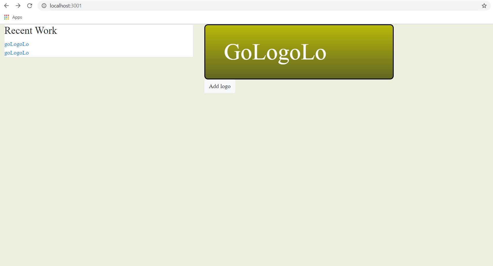

## GoLogoLo

The Logo Maker 

Made with MongoDB, Express, React, and Node. 

## How to get started
Start mongod.

-1.  Create new folder called "db" in the same path as the Server and Client folders.

-2. ADD C:\Program Files\MongoDB\Server\4.2\bin(Assuming you have the default path of MongoDB) to the Path of system Environmental Variables.

Run: 

`mongod --dbpath="(your path)" `

on your first terminal(may need more than 1) run:

`mongod --dbpath="db"`

if system enviornment not setup, run :

 `"C:\Program Files\MongoDB\Server\4.2\bin\mongod.exe" --dbpath="(your path)"`

 Now DB has been setup.

`Create New Terminal ->
run: mongod --dbpath="db" ->
Create New Terminal ->
run: cd server ->
run: nodemon (Connection should be successful) ->
Create New Terminal ->
run: cd client ->
run: npm start ->
Would you like to run the app on another port instead? (Y/n): type Y ->
Navigate to: http://localhost:3001/`

GoLogoLo Home:

GoLogoLo Create:

GoLogoLo Edit:

To create a new logo, press:

## `Create New Logo`

After creating your logo, look under `Recent Works` to find it. 

Clicking on the logo will navigate you to the `View` page.  

Once you're on the view page, you can `edit`, `delete`, or `export` your logo. Enjoy your new logo!

